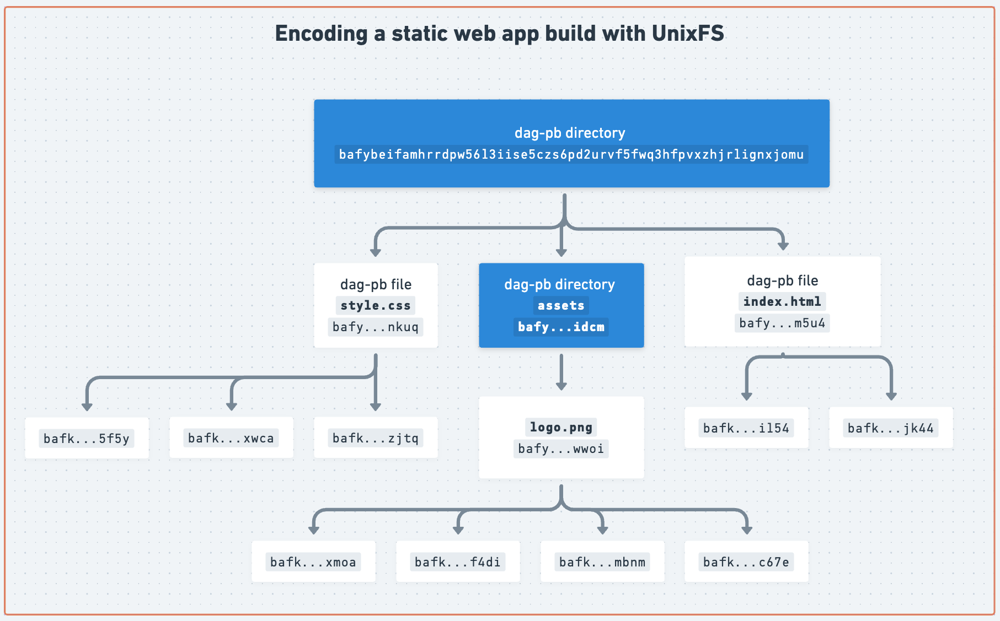

# The lifecycle of data in IPFS

- [1. Content-addressing](#1-content-addressing)
- [2. Providing](#2-providing)
- [3. Retrieving](#3-retrieving)
- [Learn more](#learn-more)

## 1. Content-addressing / Merkleizing

The first stage in the lifecycle of data in IPFS is to address it by CID. This is a local operation that takes arbitrary data and encodes it so it can be addressed by a CID.

The exact process depends on the type of data. For files and directories, this is done by constructing a [UnixFS](./file-systems.md#unix-file-system-unixfs) [Merkle DAG](./merkle-dag.md). For other data types, such as dag-cbor, this is done by encoding the data with [dag-cbor](https://ipld.io/docs/codecs/known/dag-cbor/) which is hashed to produce a CID.

For example, merkleizing a static web application into a UnixFS DAG looks like this, where the whole application is addressed by the CID in the top block (`bafy...jomu`):

## 2. Providing

In this stage, the blocks of the CID are saved on an IPFS node (or pinning service) and made retrievable to the network. Simply saving the CID on the node does not mean the CID is retrievable, so pinning must be used. Pinning allows the node to advertise that it has the CID, and provide it to the network.

- **Advertising:** In this step, a CID is made discoverable to the IPFS network by advertising a record linking the CID and the server's IP address to the [DHT](./dht.md). Advertising is a continuous process that repeats typically every 12 hours. The term **publishing** is also commonly used to refer to this step.

- **Providing:** The content-addressable representation of the CID is persisted on one of web3.storage's IPFS nodes (servers running an IPFS node) and made publicly available to the IPFS network.

## 3. Retrieving

In this stage, an IPFS node fetches the blocks of the CID and constructs the Merkle DAG. This usually involves several steps:

- **Content routing:** The IPFS node finds other IPFS nodes providing the CIDs you are requesting. Content routing is facilitated by either the [DHT](./dht.md), asking already connected peers over [Bitswap](./bitswap.md), or making an HTTP call to a [delegated routing](https://github.com/ipfs/specs/blob/main/IPIP/0337-delegated-routing-http-api.md) server like the [network indexer](https://cid.contact/). The term **content discovery** is also commonly used to refer to this step.

- **Block fetching:** An IPFS node fetches the blocks of the Merkle DAG (of the file or folder) from providers.

- **Verification:** The IPFS node verifies the blocks fetched by hashing them and ensuring that the resulting hash is correct. Note that this type of retrieval is _trustless_; that is, blocks can come from any node in the network.

- **Local access:** Once all blocks are present, the Merkle DAG can be constructed, making the file or directory underlying the CID successfully replicated and accessible.

<!-- ## 4. Deleting

At this point, the blocks associated with a CID are deleted from a node. **Deletion is always a local operation**. If a CID has been replicated to other nodes, it will continue to be available on the IPFS network.

:::callout
Once the CID is replicated by another node, it is typically advertised to DHT by default, even if it isn't explicitly pinned.
::: -->

## Learn more

Learn more about the lifecycle of data in IPFS in the following video:

@[youtube](iaVXRPsRCUc)
